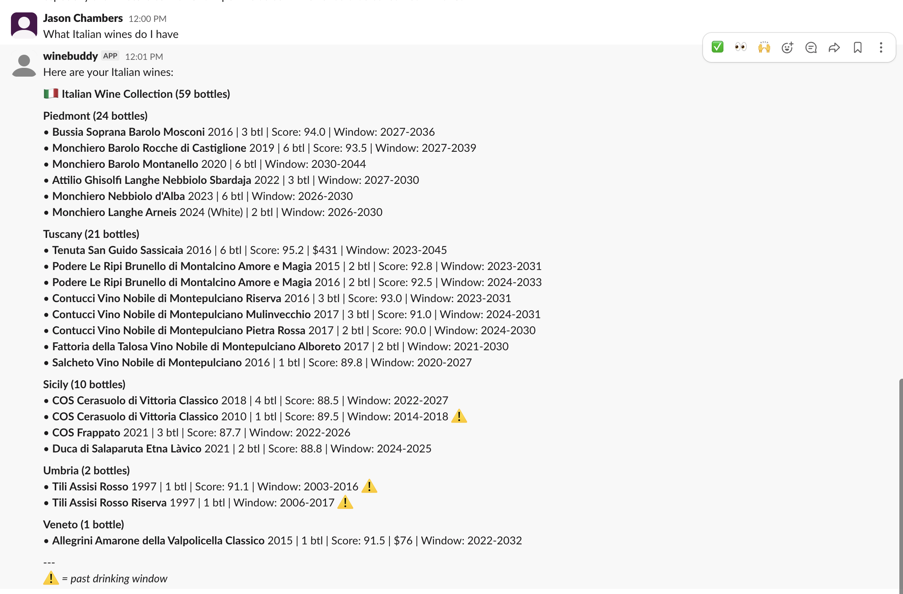

# WineBuddy Slack App

A Slack bot that lets you query your personal wine cellar using natural language. Powered by Claude and the [winebuddy](https://github.com/jasondchambers/winebuddy) skill.



## Setup

### Prerequisites

- Python 3.10+
- [uv](https://github.com/astral-sh/uv) package manager
- Claude CLI installed and configured
- [winebuddy](https://github.com/jasondchambers/winebuddy) skill installed
- A Slack workspace where you can install apps

### Installation

```bash
git clone <repo-url>
cd winebuddy-slack-app
uv sync
```

### Slack App Configuration

1. Create a new Slack app at https://api.slack.com/apps
2. Enable **Socket Mode** in your app settings
3. Generate an **App-Level Token** with `connections:write` scope
4. Under **OAuth & Permissions**, add these bot token scopes:
   - `chat:write`
   - `app_mentions:read`
   - `im:history` (for DMs)
   - `channels:history` (for public channels)
5. Enable **Event Subscriptions** and subscribe to:
   - `message.im`
   - `message.channels`
   - `app_mention`
6. Install the app to your workspace

### Environment Variables

```bash
export SLACK_BOT_TOKEN="xoxb-..."   # Bot User OAuth Token
export SLACK_APP_TOKEN="xapp-..."   # App-Level Token for Socket Mode
```

[Doppler](https://www.doppler.com/) is recommended for managing these secrets.

## Usage

```bash
uv run python main.py
```

Or with Doppler for secrets injection:

```bash
doppler run -- uv run python main.py
```

Then message the bot in Slack:

> What French wines do I have?

> Show me wines ready to drink this year

> Do I have any Pinot Noir?

## Security Features

- **Input sanitization** - Strips control characters, enforces length limits
- **Rate limiting** - 5 second cooldown between requests per user
- **Stdin isolation** - User input passed via stdin, not command arguments
- **Bot loop prevention** - Ignores messages from other bots

## Configuration

| Constant | Default | Description |
|----------|---------|-------------|
| `MAX_MESSAGE_LENGTH` | 2000 | Maximum characters per message |
| `RATE_LIMIT_SECONDS` | 5 | Cooldown between requests per user |

## Architecture

```
Slack (Socket Mode) → main.py → Claude CLI → /winebuddy skill → Response
```

The app uses Slack's Socket Mode for real-time communication without needing a public HTTP endpoint.

The `/winebuddy` skill handles wine cellar queries via Claude. See the [winebuddy repository](https://github.com/jasondchambers/winebuddy) for skill installation and configuration.
